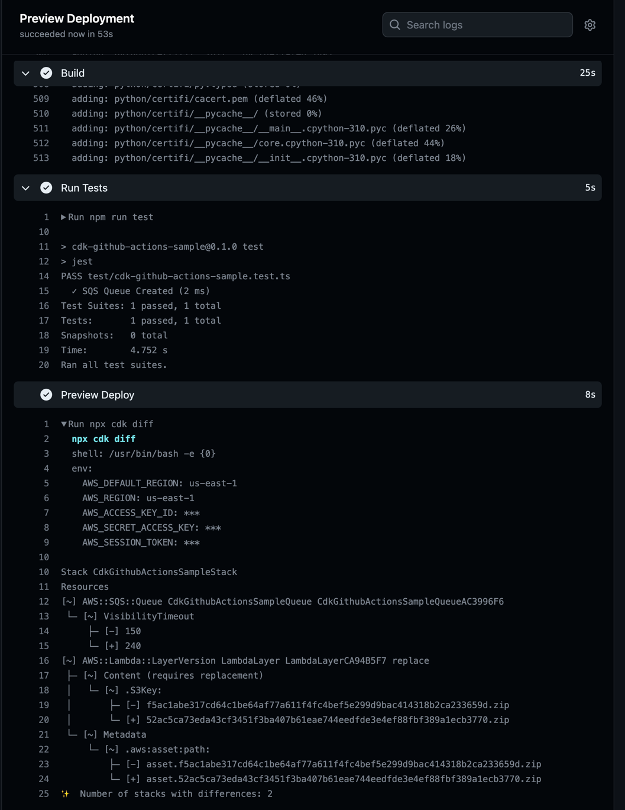
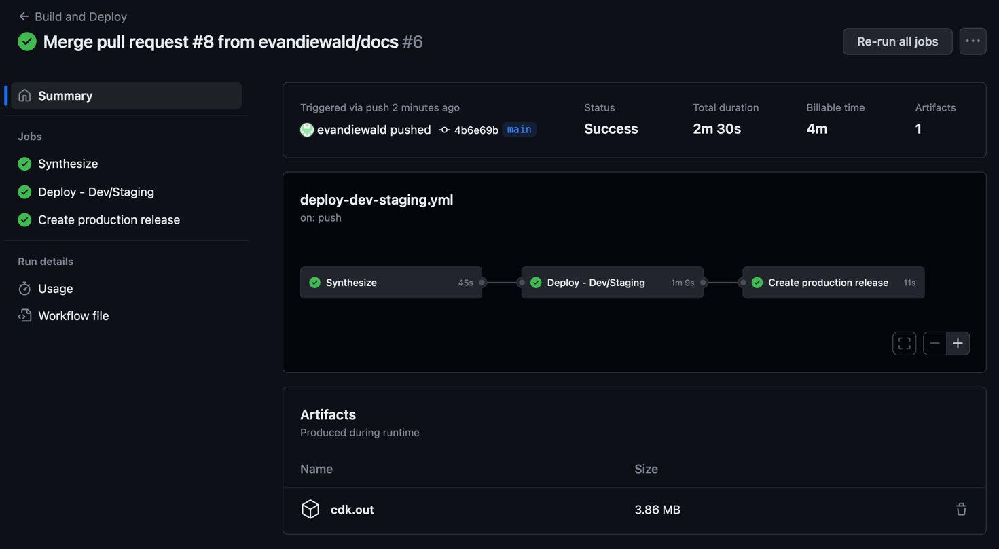
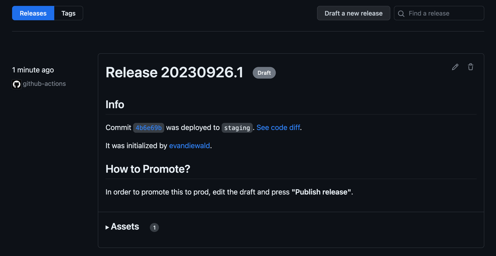
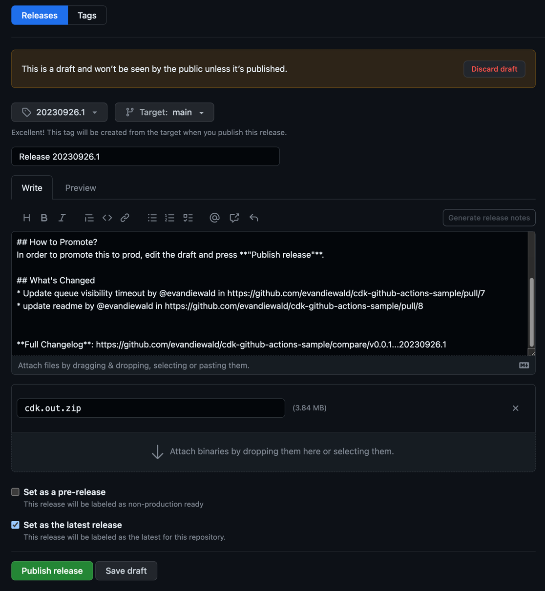

# cdk-github-actions-sample

This CDK app and associated workflows demonstrate how to deploy infrastructure via GitHub Actions. 

## Details

### First-Time Setup

#### Update the `GithubActionRole` to allow workflows to run from this repository

The workflow retrieves short-lived credentials to authenticate with AWS by assuming a role managed by another [repository](https://github.com/evandiewald/cdk-github-actions-setup). To use that role to deploy additional repositories' workflows, you need to update the trust policy in that role by adding the repository name (e.g. OWNER/repo-name) to the CDK context. See the README in [`cdk-github-actions-setup`](https://github.com/evandiewald/cdk-github-actions-setup/README.md) for more details.

#### Bootstrap Deployment Accounts (if necessary)

Every account that you intend to deploy infrastructure into must be [bootstrapped](https://docs.aws.amazon.com/cdk/v2/guide/bootstrapping.html). Use the `--trust` flag to allow cross-account deployments. For example, to allow the pipeline account (the account where the `GithubActionsRole` is deployed) to deploy into the staging account, run this command **while authenticated in the staging account**:

`cdk bootstrap aws://STAGING_ACCOUNT_ID/REGION --trust PIPELINE_ACCOUNT_ID`

#### Configure Secrets

You will also need to configure the necessary [secrets](https://docs.github.com/en/actions/security-guides/using-secrets-in-github-actions) used by the workflows, including `ACTIONS_ROLE_ARN` (the ARN of the `GithubActionsRole`), `AWS_ACCOUNT_ID_DEVELOPMENT`, `AWS_ACCOUNT_ID_STAGING`, and `AWS_ACCOUNT_ID_PRODUCTION`. 

### Ongoing Usage

Once the first-time setup is complete, you can run the workflows to preview, build, and deploy infrastructure automatically, as part of your normal version control / code review procedures. This example scenario is for a 3-environment setup (Dev/Stage/Prod), but can easily be adjusted for other configurations.

#### PR Opened - Preview Build

[**preview-deploy.yml**](.github/workflows/preview-deploy.yml): when a PR is **opened**, the stack is synthesized, tests are run, and `cdk diff` is performed so that you can preview any changes that would be made to the development account.

#### PR Merged - Deploy to Dev and Staging

[**deploy-dev-staging.yml**](.github/workflows/deploy-dev-staging.yml): when a PR is **merged**, CDK stacks are first synthesized for multiple environments (Dev/Stage/Prod) using CDK Stages. This example build also includes [packaging of a lambda layer](scripts/build_ci.sh) to show how to incorporate multiple steps into the workflow. The current configuration is to deploy to Development, then Staging in series. After successful deployment to Staging, a draft release is created.

#### After Successful Deployment to Dev/Staging - Deploy to Prod

[**deploy-production.yml**](.github/workflows/deploy-production.yml): The [deploy-dev-staging.yml](.github/workflows/deploy-dev-staging.yml) workflow creates a draft release as the last step. 

To deploy this release to production, go into the draft release and click "Publish Release". This will trigger the production deployment.

Other ideas:
- Adjust the workflow to only run if changes were made to the CDK infrastructure itself and not, for instance, this README.
- Have another repository that just manages the workflows, since there will obviously be a lot of code reuse there.
